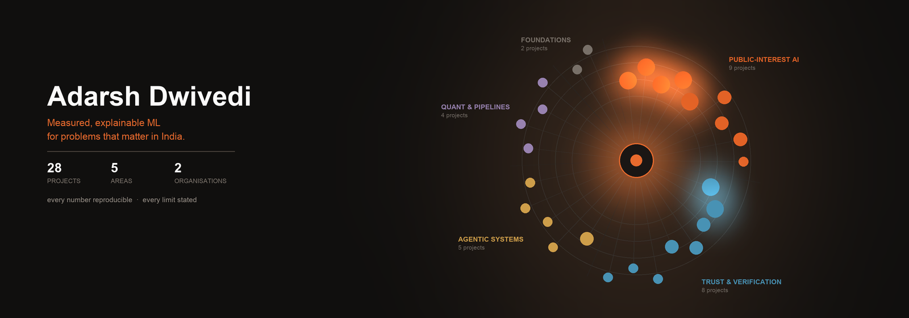
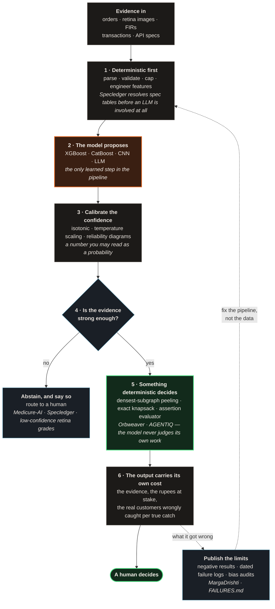
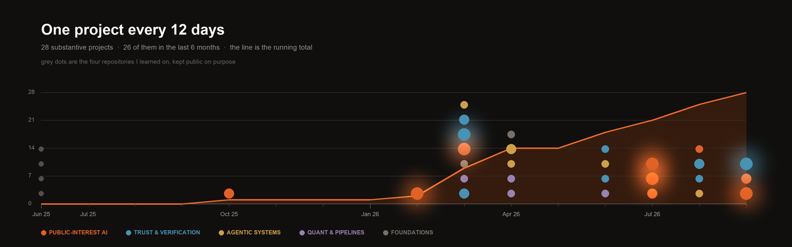

<div align="center">



### [Orbweaver](https://github.com/adarshcod30/Orbweaver) · [Kadi](https://github.com/adarshcod30/Kadi) · [KrishiMitra](https://github.com/adarshcod30/KrishiMitra) · [Vayu](https://github.com/adarshcod30/Vayu) · [MargaDrishti](https://github.com/adarshcod30/MargaDrishti) · [VaidyaMitra](https://github.com/VaidyaMitra/VaidyaMitra) · [AGENTIQ](https://github.com/B-TechProject/AGENTIQ)

**[Every project, grouped →](PROJECTS.md)**

</div>

---

I build machine-learning systems for problems that already have victims — crop
loss, air quality, road capacity, fraud rings, misdiagnosis, thin-file credit —
and I build them so a sceptical reader can check every claim I make.

## The shape almost everything I build takes

A model is allowed to *propose*. Something deterministic — a threshold, a
knapsack, a peeling objective, an assertion evaluator — is what *decides*. That
separation is the single design decision I repeat most, because it is what
makes "why did this happen?" answerable by a person.



**Why it is worth the extra work.** Ring membership in Orbweaver comes from a
peeling objective with a proved ½-approximation bound, so "why is this account
in this ring?" is checkable arithmetic rather than a model's opinion. AGENTIQ
generates test assertions with an LLM and then evaluates them with a tool,
because a model grading its own output is not evidence. Specledger's extraction
works with the LLM switched off entirely — the model adds recall, it is not
load-bearing.

<div align="center">



</div>

## Selected work

### Public-interest AI — *problems that already have victims*

| Project | The hard part |
|---|---|
| **[KrishiMitra](https://github.com/adarshcod30/KrishiMitra)** | CatBoost crop recommendations cross-checked against **five years of government district returns**, leaf disease at **93.75%** over 10,162 images, FAO-56 irrigation advisory, Soil Health Card baselines from **13.35M** tests. 12 languages, deployed free |
| **[Vayu](https://github.com/adarshcod30/Vayu)** | LightGBM + CNN-LSTM forecasting over a **15,360-cell** satellite grid, Gaussian-plume ROI ranking, and **difference-in-differences** verification that an intervention actually worked — never a guessed AQI |
| **[Kadi](https://github.com/adarshcod30/Kadi)** | **59,985** siloed FIRs into one explainable link graph across **31 districts** and **298 stations**. Shared modus operandi ranks as a *hypothesis*, never as a name. The translator refuses to touch FIR numbers, dates and identifiers |
| **[VaidyaMitra](https://github.com/VaidyaMitra/VaidyaMitra)** ⟨org⟩ | Every identifier is masked **before** it reaches the model. Jan Aushadhi generic matching with substitution-safety warnings, vision OCR, ten Indian languages, on Amazon Bedrock |
| **[MargaDrishti](https://github.com/adarshcod30/MargaDrishti)** | Bengaluru road-capacity loss on one H3 × hourly substrate — **298k** violations, 8 model families, and a published audit of enforcement bias *in its own training data* |
| **[Diabetic-Retinopathy-Detection](https://github.com/adarshcod30/Diabetic-Retinopathy-Detection)** | Temperature-scaled confidence with reliability diagrams and ECE; low-confidence cases escalate to a human grader. Front page says *not a medical device*, because it is not |
| **[Medicure-AI](https://github.com/adarshcod30/Medicure-AI)** | Photograph a strip → composition, NPPA price, Jan Aushadhi generic, interaction warnings — each with a calibrated confidence and an honest refusal when evidence is thin |
| **[CreditSetu](https://github.com/adarshcod30/CreditSetu)** | `pip install creditsetu`. Validated against **150,000 real borrowers** with real default outcomes — **0.82 AUC using only 7 of 14 features**, to close the circularity gap of testing on its own synthetic data |

### Trust and verification — *deciding whether to believe something*

| Project | The hard part |
|---|---|
| **[Orbweaver](https://github.com/adarshcod30/Orbweaver)** | Densest-subgraph extraction over a **35.7M-edge** account graph: **0.7292** ring precision against a **0.2242** base rate, always reported with the **0.371** real customers swept in per fraudster caught. 36 dated failures published alongside |
| **[AGENTIQ](https://github.com/B-TechProject/AGENTIQ)** ⟨org⟩ | B.Tech final-year project. Six vulnerability families probed by **baseline differential**, so a finding needs a material deviation rather than a suspicious-looking string. Every outbound request passes a permission-checked, SSRF-guarded, audited tool layer |
| **[artifact-repro-triage](https://github.com/adarshcod30/artifact-repro-triage)** | Checks whether a paper's repository contains what its README promises. **0% → 100%** detection of fabricated file claims across **742** artifacts |
| **[OpenForensics](https://github.com/adarshcod30/OpenForensics)** | Three-backbone deepfake ensemble with calibrated confidence and per-backbone Grad-CAM — the dashboard shows the evidence, not just the verdict |
| **[Specledger](https://github.com/adarshcod30/Specledger)** | A logistic calibrator over **11 evidence features** picks an auto-publish threshold hitting a measured precision floor on held-out data — instead of trusting an LLM's self-reported confidence |
| **[MedGuardX](https://github.com/adarshcod30/MedGuardX)** | Context-aware PII/PHI masking: an engine on PyPI, a hardened FastAPI service with JWT RBAC, and an app on top |

### Agentic systems · quant · foundations

| Project | The hard part |
|---|---|
| **[SmartAlloc](https://github.com/adarshcod30/SmartAlloc)** | A 7-agent LangGraph pipeline over linear programming that finds compute waste and predicts SLA bottlenecks before they land |
| **[Talent-Intelligence](https://github.com/adarshcod30/Talent-Intelligence-Candidate-Discovery-Platform)** | **100,000** candidates ranked in under **18 seconds**, CPU only, with honeypot and fake-profile filtering |
| **[PrimeTradeDS](https://github.com/adarshcod30/PrimeTradeDS)** | **211K** Hyperliquid trades against Bitcoin Fear/Greed sentiment — what moves trader behaviour, and what does not |
| **[Adaptive-Graph-Search-Suite](https://github.com/adarshcod30/Adaptive-Graph-Search-Suite)** | Graph traversal on realistic map topologies, built to be watched while it runs |

## Receipts for "every limit is written down"

The claim is cheap; these are the times it cost me something.

| Where | What I published anyway |
|---|---|
| **MargaDrishti** | A target of PR-AUC ≥ 0.45 was set assuming ~10% prevalence. The real label rate is **0.291%**, so the goal was unreachable *by construction*. Reported as a **46.9× lift** over base rate with the original goal marked wrong — not as a 3× shortfall |
| **MargaDrishti** | Seven model families all returned PR-AUC **0.9999** on one task. That is the signature of a recovered business rule, not a hard problem — so it is reported as a *recovered rule*, because presenting it as modelling performance would mislead |
| **MargaDrishti** | The review process changed regime mid-window, so every model on that task is miscalibrated. Reported as **not-yet-answerable** rather than as a weak result |
| **Orbweaver** | Four of thirteen investigations came back negative and are published beside the nine that worked, including one where the hypothesis was exactly backwards |
| **CreditSetu** | The live demo runs on synthetic data, and the README says so *above* the numbers rather than below them |

## How I work

```
Python · PyTorch · XGBoost / LightGBM / CatBoost · scikit-learn · igraph
FastAPI · Streamlit · Next.js / TypeScript · Docker · GitHub Actions
AWS Bedrock · Google Cloud Run · Vercel · Render · pandas / PyArrow · LangGraph
```

The stack matters less than the discipline around it: a temporal split a test
enforces, a held-out set nothing touches, the false-positive cost printed next
to the detection rate, and a `FAILURES.md` recording what I got wrong on the
way there.

## This repository builds itself

The banner, the timeline and [PROJECTS.md](PROJECTS.md) are generated from the
GitHub API — my own repositories and both organisations — so none of them can
quietly fall behind what I have actually shipped:

```bash
make refresh    # pull the current repository list
make assets     # redraw the banner and the timeline
make index      # rewrite PROJECTS.md
make            # the last two
```

Claiming reproducibility on 28 projects and then hand-maintaining my own
profile would have made this the one dishonest page on the account.

## Elsewhere

Final-year computer science at **LNMIIT Jaipur**. I build under two
organisations — [VaidyaMitra](https://github.com/VaidyaMitra) for clinical
work and [B-TechProject](https://github.com/B-TechProject) for my final-year
project. Most of what I build ends up deployed somewhere free, because a model
nobody can open is a claim nobody can check.

<div align="center">

[](https://github.com/adarshcod30)
[](mailto:23ucs509@lnmiit.ac.in)
[](https://www.linkedin.com/in/adarshdwivedi30/)

</div>
